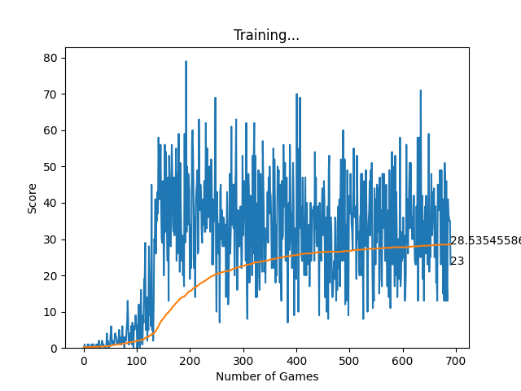
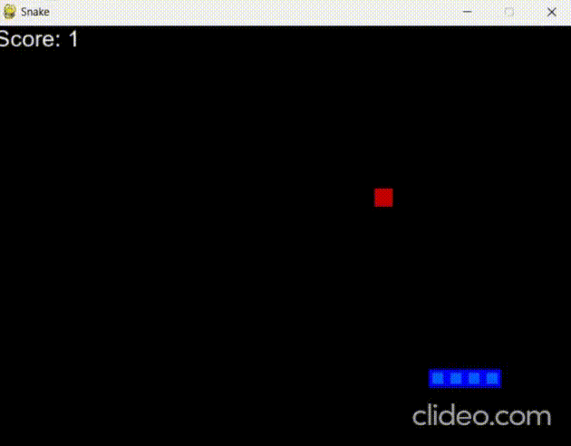

# Playing Snake with Reinforcement Learning
#
This is a simple implementation of the classic game Snake, where the player controls a snake that grows in length as it eats food. The game ends when the snake collides with itself or the wall. The goal of this project is to train an agent to play the game using reinforcement learning.

## Getting Started

### Prerequisites
This project requires Python 3.6 or later. The [following](./requirements.txt) packages are also required to be installed via 
```bash
pip install -r requirements.txt
```

### Usage
To train the agent, run
```bash
python agent.py
```
with the line `train()` uncommented in the `main()` function. To test the agent, run the same command with `play_round(filename)` uncommented instead. The `filename` argument should be the `.pth` file containing the trained model.

To run the Human Playable version of the game, run
```bash
python user_playable_game.py
```

## Graph showing the average score per episode


You can clearly see that the agent is learning to play the game. The average score per episode increases as the agent learns to play the game better. The agent is able to achieve an average score of 28.53 after 691 episodes. The max score was 79 while the min score was 0.

## Example of the agent playing the game


